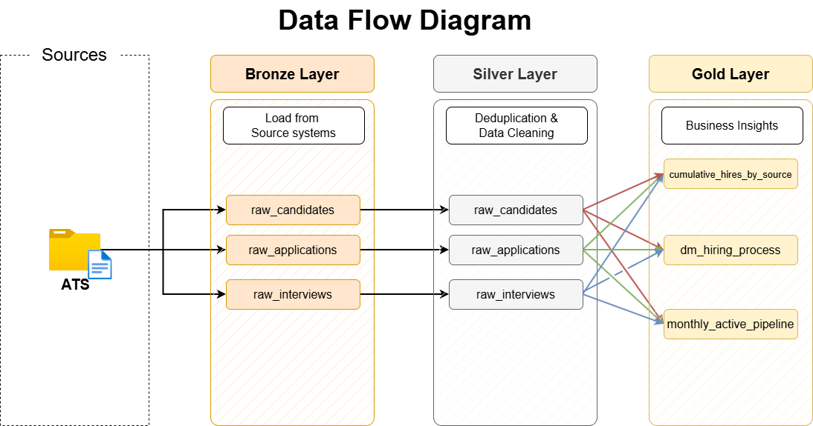

# DE in People

A data engineering internship project implementing a medallion architecture for an Applicant Tracking System (ATS) data warehouse.

## Overview

This project processes ATS data through three layers of the medallion architecture:
- **Bronze**: Raw data from source systems (CSV files)
- **Silver**: Cleaned and validated data
- **Gold**: Aggregated data for analytics and reporting

## Project Structure

```
de-in-people/
├── README.md
├── .gitignore
├── requirements.txt
├── datasets/
│   ├── gen/
│   │   └── generate_data.py              # Data generation scripts
│   └── source_ats/
│       ├── raw_applications.csv          # Raw source data
│       ├── raw_candidates.csv
│       └── raw_interviews.csv
├── scripts/
│   ├── init_database.sql                 # Database initialization
│   ├── bronze/                           # Raw data layer
│   ├── silver/                           # Data cleaning and transformation
│   └── gold/                             # Aggregated analytics data
│       ├── dm_hiring_process.sql         # Hiring process metrics
│       ├── monthly_active_pipeline.sql   # Pipeline activity by month
│       └── cumulative_hires_by_source.sql # Hire source analysis
├── docs/                                 # Documentation
├── quality_checks/                       # Data validation scripts
└── .git/                                 # Version control
```

## Data Flow Diagram



## Setup

1. Install dependencies:
   ```bash
   pip install -r requirements.txt
   ```

2. Generate sample data:
   ```bash
   python datasets/gen/generate_data.py
   ```

## Development

Data processing workflows move data through the medallion layers for transformation and quality assurance.
